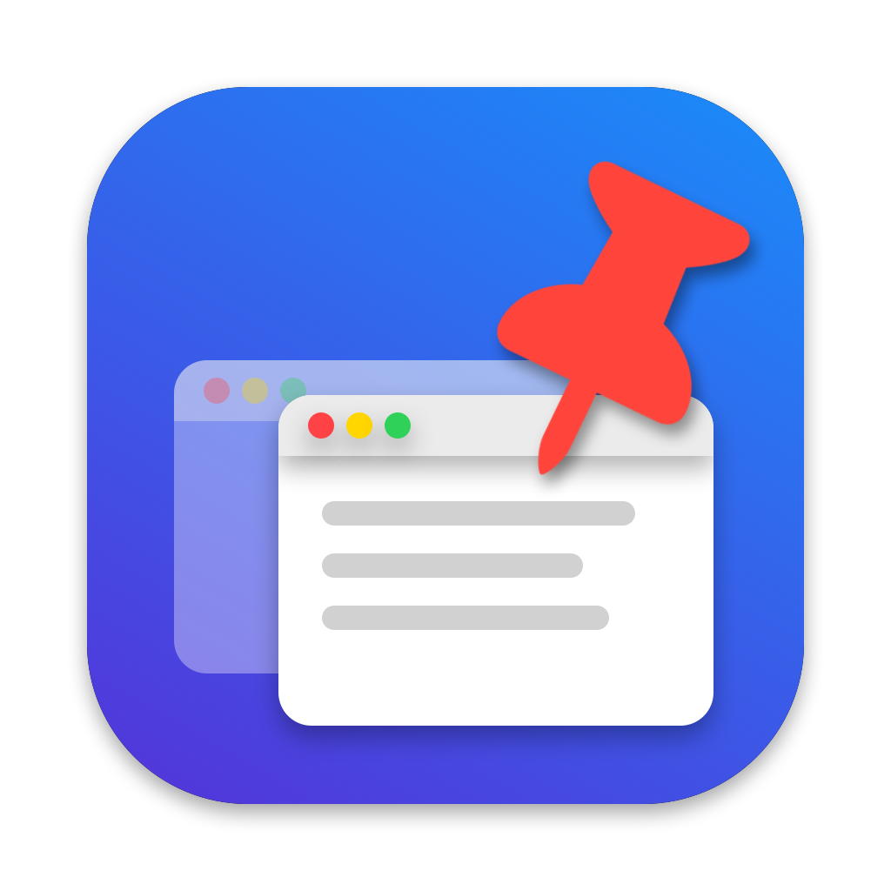

<p align="center"></p>

<h1 align="center">Épingle</h1>

<p align="center">Mettez n'importe quelle fenêtre au premier plan et épinglez-la au-dessus de toutes les autres sur macOS.</p>

## Fonctionnalités

- **Barre de menus** : liste des fenêtres ouvertes, pour les mettre au premier plan ou les épingler.
- **⌃⌥P** : épingle ou désépingle la fenêtre active.
- **Fenêtre épinglée** : cliquez pour travailler dedans, glissez pour la déplacer, clic droit pour la désépingler.
- Visible sur tous les bureaux, y compris par-dessus les apps en plein écran.
- Ouverture automatique à l'ouverture de session (activable dans le menu).

## Comment ça marche

macOS n'autorise pas une app à modifier le niveau des fenêtres d'une autre app. Épingle affiche donc une **copie en direct** de la fenêtre (via ScreenCaptureKit) dans un panneau flottant. Un clic sur la copie amène la vraie fenêtre à cet endroit et lui donne le focus ; dès que vous passez à une autre app, la copie reprend sa place au premier plan.

La capture reste locale : rien n'est enregistré ni envoyé. L'indicateur violet d'enregistrement d'écran de macOS s'affiche tant qu'une fenêtre est épinglée.

## Installation

Nécessite macOS 14+ (Apple Silicon) et les Command Line Tools (`xcode-select --install`).

```sh
./build.sh
```

L'app est compilée puis installée dans `/Applications/Epingle.app`. Au premier lancement, autorisez Épingle dans **Réglages Système → Confidentialité et sécurité** :

- **Accessibilité** : pour mettre les fenêtres au premier plan et les déplacer.
- **Enregistrement de l'écran** : pour afficher la copie des fenêtres épinglées.

L'icône est générée par `swift Tools/make-icon.swift`.
